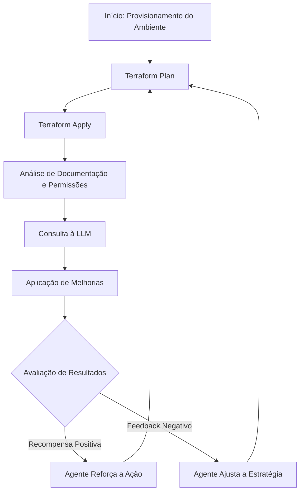
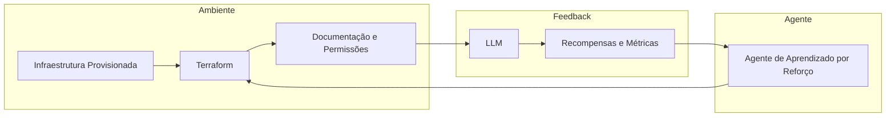

# Otimizando a Infraestrutura com Aprendizado por Reforço e Terraform

Neste artigo, discutimos como o **Aprendizado por Reforço (RL)** pode ser empregado para otimizar operações e segurança na infraestrutura de forma adaptativa, integrando o fluxo iterativo do Terraform com feedback contínuo do ambiente e das análises. Essa abordagem é particularmente interessante para projetos que demandam ajustes dinâmicos e melhoria contínua, permitindo que o agente aprenda com cada iteração e refine suas ações para obter melhores resultados.

---

## Contexto do Projeto

O cenário proposto envolve um ambiente que passa por diversas fases, tais como:
- **Subir o ambiente:** Provisionamento inicial da infraestrutura.
- **Executar _plan_ e _apply_ do Terraform:** Validação e aplicação das configurações.
- **Analisar documentação e permissões:** Verificação e auditoria de segurança e conformidade.
- **Consultar a LLM (Large Language Model):** Obtenção de insights e sugestões a partir de uma inteligência artificial.
- **Aplicar melhorias:** Implementação de ajustes nos arquivos Terraform com base no feedback recebido.

Esse ciclo iterativo é perfeito para a aplicação de algoritmos de Aprendizado por Reforço, onde um agente autônomo pode experimentar diferentes estratégias, medir o impacto das mudanças e ajustar seu comportamento com base em recompensas definidas pelos resultados das operações e da segurança.

---

## Por que Aprendizado por Reforço?

O **Aprendizado por Reforço** é uma técnica de machine learning onde um agente interage com um ambiente, toma decisões e recebe feedback na forma de recompensas. Essa abordagem se adapta de forma natural ao fluxo iterativo do nosso projeto, pois:

- **Exploração e Exploração:** O agente pode testar diversas ações, como ajustes nos arquivos Terraform, e aprender quais estratégias maximizam a eficiência e segurança.
- **Feedback Contínuo:** A cada iteração, o ambiente fornece um retorno que serve como base para ajustes futuros.
- **Adaptação Dinâmica:** Com o tempo, o agente refina seu comportamento para otimizar as operações, identificando e implementando melhorias contínuas.

---

## Fluxo Iterativo com Aprendizado por Reforço

A seguir, apresentamos um diagrama em Mermaid que ilustra o fluxo iterativo do processo, integrando o Terraform com a análise de segurança e o feedback da LLM:

Neste diagrama, o ciclo de interação entre as etapas é evidenciado. O agente recebe feedback do ambiente (passo "Avaliação de Resultados") e, com base nisso, ajusta suas ações para a próxima iteração.

---

## Arquitetura do Sistema com Aprendizado por Reforço

Uma outra forma de visualizar a integração entre os componentes do sistema é através de uma arquitetura que destaque a interação entre o agente, o ambiente e os módulos de análise. O diagrama a seguir demonstra essa interação:

Neste modelo, o agente de RL está continuamente aprendendo a partir das métricas e recompensas fornecidas pelo feedback do sistema e da LLM, permitindo ajustes dinâmicos e a evolução do desempenho do sistema.

---

## Benefícios e Desafios da Abordagem

### Benefícios

- **Otimização Contínua:** Com feedback iterativo, o sistema se torna progressivamente mais eficiente e seguro.
- **Flexibilidade:** O agente pode explorar diversas estratégias, adaptando-se a mudanças e imprevistos no ambiente.
- **Automação Inteligente:** Reduz a necessidade de intervenção humana constante, permitindo que o sistema se autoaperfeiçoe.

### Desafios

- **Complexidade na Definição de Recompensas:** Estabelecer métricas que realmente reflitam a melhoria do ambiente pode ser desafiador.
- **Ambiente de Treinamento:** A simulação do ambiente deve ser suficientemente precisa para que o aprendizado seja válido e transferível para a operação real.
- **Integração com Sistemas Existentes:** Garantir a compatibilidade e a segurança ao integrar o RL com ferramentas como o Terraform e a LLM exige cuidados técnicos e de governança.

---

## Considerações Finais

A utilização do Aprendizado por Reforço para otimização de infraestruturas provisionadas via Terraform representa uma evolução significativa em termos de automação e adaptação. Ao integrar métodos de RL ao ciclo iterativo de análise e aplicação de melhorias, é possível alcançar um sistema que não só responde às necessidades atuais, mas também evolui de forma inteligente frente a desafios futuros.

Esta abordagem pode transformar a maneira como gerenciamos a infraestrutura, proporcionando ganhos em eficiência operacional e segurança, ao mesmo tempo em que minimiza erros e adapta-se continuamente ao ambiente dinâmico dos sistemas modernos.

---

Este artigo apresentou uma visão geral sobre a aplicação de Aprendizado por Reforço em um fluxo iterativo que envolve o Terraform, análise de permissões, e feedback da LLM. Espera-se que essa abordagem inspire novos projetos e soluções inovadoras na área de automação de infraestrutura.