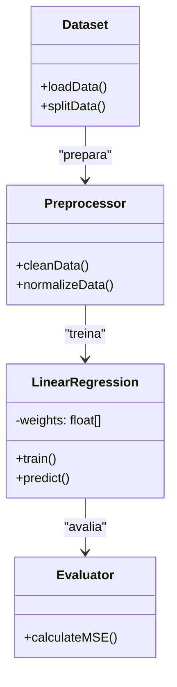
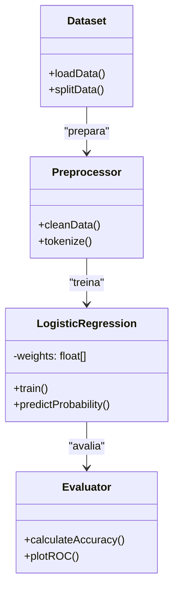
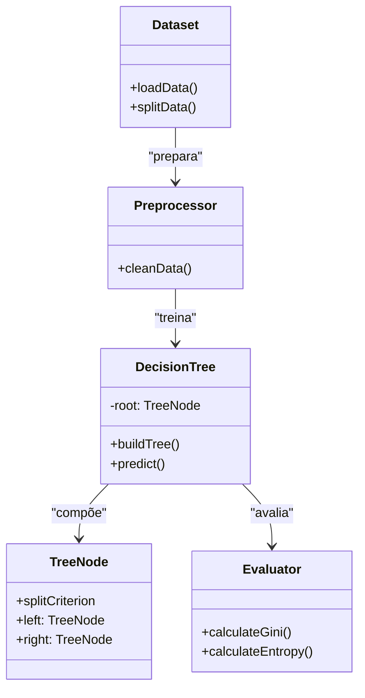
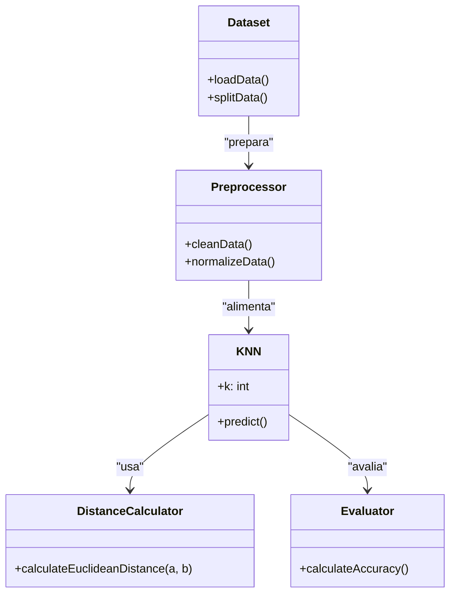
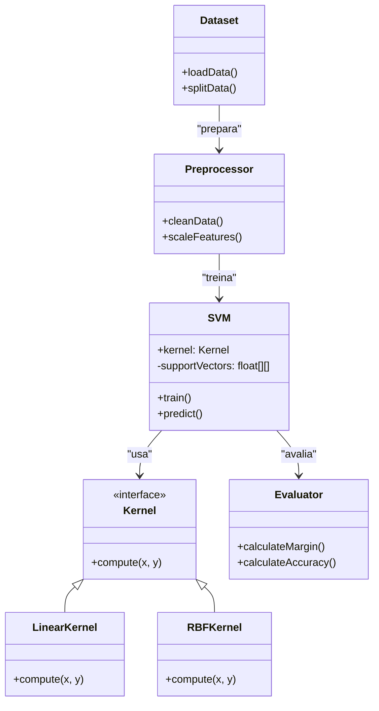
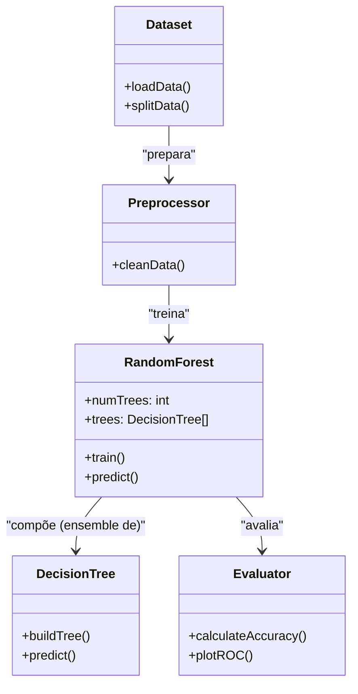
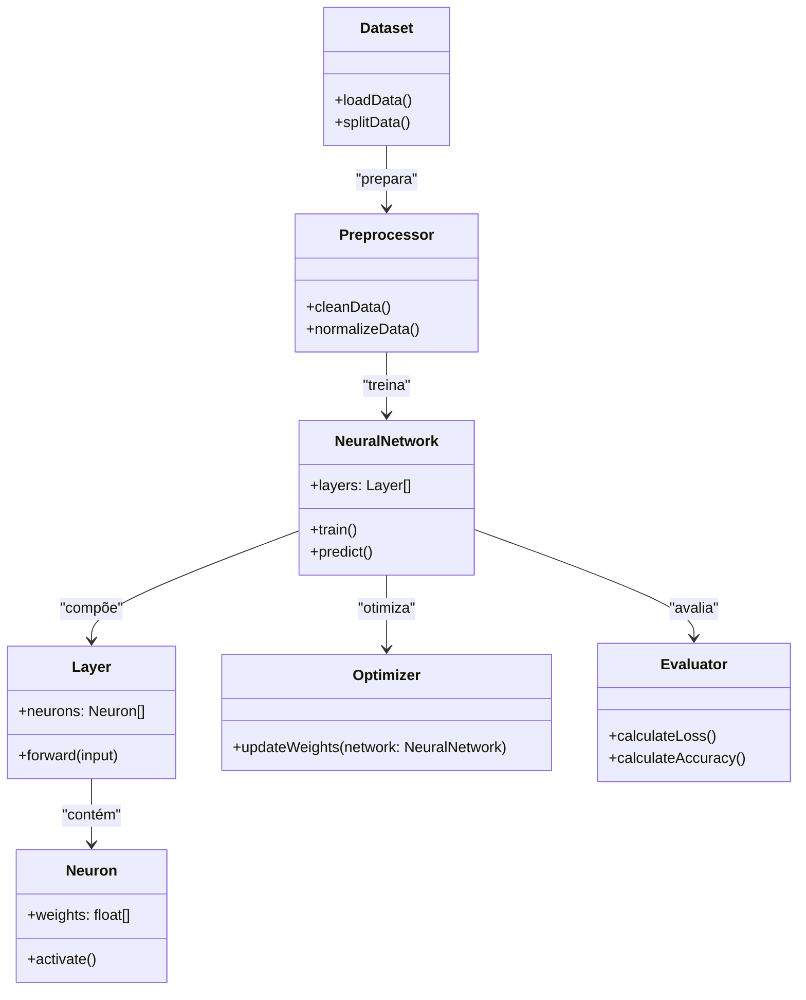
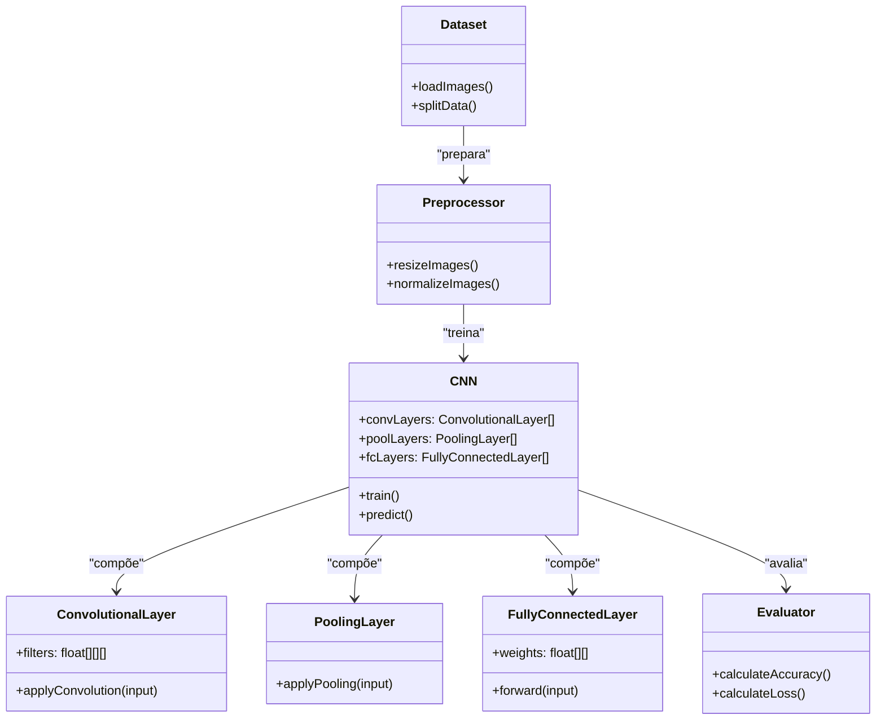
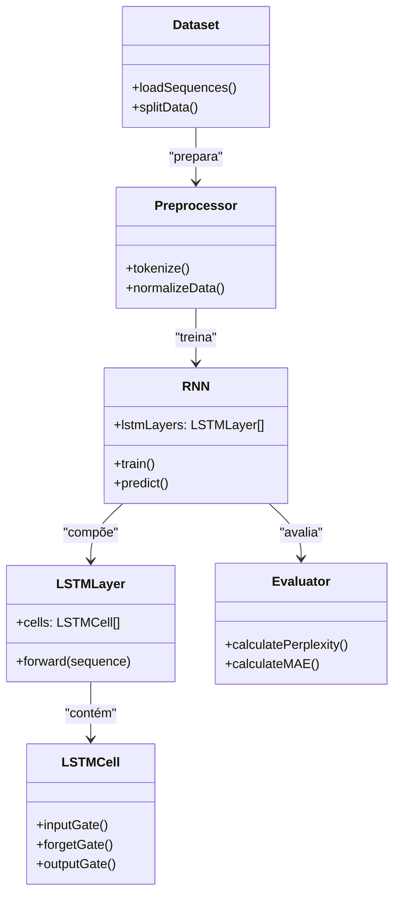
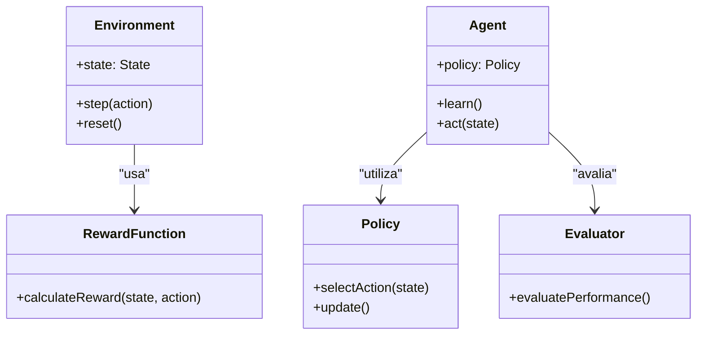

# Algoritmos de Aprendizado de Máquina

A seguir, apresento uma série de exemplos de algoritmos de aprendizado de máquina – do básico ao avançado – representados por diagramas de classes em Mermaid. Cada exemplo ilustra, de forma simplificada, como os componentes (classes) interagem para formar o pipeline ou a estrutura interna do algoritmo.

---

### 1. Regressão Linear (Básico)
**Contexto:** Previsão de preços de casas usando uma relação linear entre as variáveis.

---

### 2. Regressão Logística (Básico/Intermediário)
**Contexto:** Classificação de emails como spam ou não, com base em uma função logística.

---

### 3. Árvore de Decisão (Intermediário)
**Contexto:** Aprovação de empréstimos com base em critérios como renda e histórico de crédito.

---

### 4. k-Nearest Neighbors (KNN) (Intermediário)
**Contexto:** Classificação de flores em espécies (ex.: conjunto Iris) com base na similaridade entre as instâncias.

---

### 5. Máquina de Vetores de Suporte (SVM) (Intermediário/Avançado)
**Contexto:** Reconhecimento de dígitos manuscritos com a utilização de kernels para encontrar o hiperplano ótimo.

---

### 6. Random Forest (Avançado)
**Contexto:** Diagnóstico médico utilizando o ensemble de múltiplas árvores de decisão para maior robustez.

---

### 7. Redes Neurais Artificiais (Avançado)
**Contexto:** Reconhecimento de padrões em imagens ou outros dados por meio de múltiplas camadas de processamento.

---

### 8. Redes Neurais Convolucionais (CNN) (Muito Avançado)
**Contexto:** Identificação de objetos em imagens utilizando camadas especializadas para extração e redução de características.

---

### 9. Redes Neurais Recorrentes com LSTM (Muito Avançado)
**Contexto:** Processamento de sequências temporais ou texto, capturando dependências de longo prazo.

---

### 10. Aprendizado por Reforço (Reinforcement Learning) (Avançado)
**Contexto:** Treinamento de um agente para aprender estratégias em um ambiente simulado, como jogos ou robótica.

---

Cada diagrama de classe acima representa, de forma simplificada, os componentes principais e as relações existentes no fluxo de trabalho ou na estrutura interna dos algoritmos de aprendizado de máquina, permitindo visualizar como os dados, o pré-processamento, o treinamento e a avaliação se interconectam em cada cenário. Esses modelos podem ser expandidos ou adaptados conforme as necessidades específicas de uma implementação real.