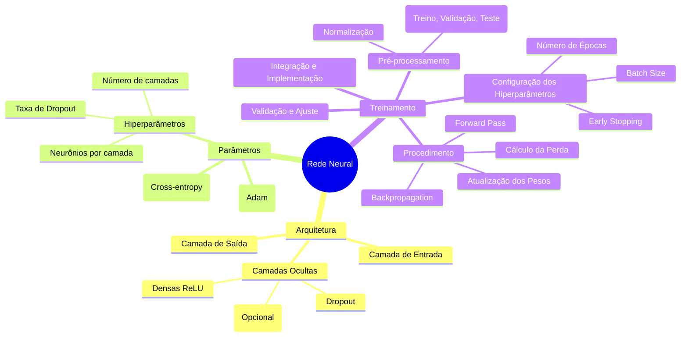
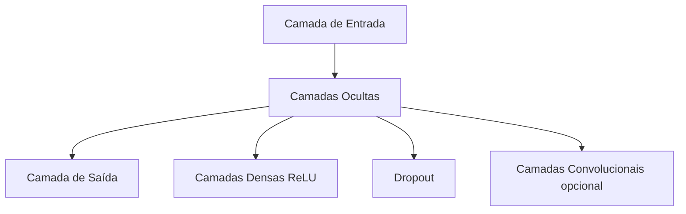
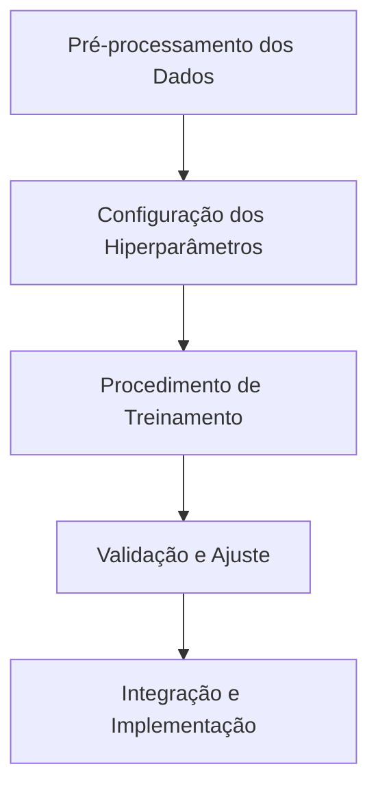

# Rede Neural

Este documento descreve em detalhes a arquitetura e o treinamento da rede neural utilizada no projeto.

## Arquitetura

A rede neural foi construída para atender aos requisitos do projeto, com o objetivo de processar e analisar dados de forma eficiente. Sua arquitetura inclui:

- **Camada de Entrada**: Recebe os dados pré-processados, normalizados e preparados para a inferência.
- **Camadas Ocultas**: Implementadas com camadas densas totalmente conectadas e funções de ativação ReLU. São utilizadas:
  - Múltiplas camadas densas para capturar padrões complexos nos dados.
  - Camadas de Dropout para evitar overfitting.
  - Eventualmente, camadas convolucionais se os dados exigirem extração localizada de características.
- **Camada de Saída**:
  - Utiliza função de ativação _softmax_ (para problemas de classificação) ou _sigmoide_ (para regressão), conforme o objetivo, com número de neurônios correspondente às classes ou valores a serem previstos.

### Diagrama da Arquitetura

**Parâmetros principais**:
- **Função de Perda**: Tipicamente cross-entropy para problemas de classificação.
- **Otimizador**: Adam, com uma taxa de aprendizado ajustável para promover a convergência.
- **Hiperparâmetros**: Número de camadas, neurônios por camada, e taxa de dropout, que podem ser ajustados conforme os experimentos e desempenho do modelo.

## Treinamento

### Diagrama do Treinamento

O processo de treinamento da rede neural segue as práticas recomendadas para garantir desempenho e generalização:

1. **Pré-processamento dos Dados**:
   - Normalização e padronização dos dados de entrada.
   - Divisão dos dados em conjuntos de treinamento, validação e teste.
2. **Configuração dos Hiperparâmetros**:
   - Definição do número de épocas (por exemplo, 100 épocas).
   - Tamanho do lote (batch size), por exemplo, 32.
   - Critérios de early stopping para prevenir overfitting.
3. **Procedimento de Treinamento**:
   - Execução do _forward pass_ para computar as predições.
   - Cálculo da função de perda baseada nas predições e nos valores reais.
   - Aplicação do _backpropagation_ para ajustar os pesos da rede.
   - Atualização dos parâmetros utilizando o otimizador.
4. **Validação e Ajuste**:
   - Monitoramento das métricas (acurácia, F1-score, etc.) no conjunto de validação.
   - Ajuste fino dos hiperparâmetros conforme os resultados obtidos.
5. **Integração e Implementação**:
   - Após o treinamento, o modelo é integrado aos demais módulos do sistema para realizar inferências.
   - Testes adicionais são conduzidos para garantir a robustez e eficiência do modelo em cenário de produção.

## Considerações Finais

A implementação dessa rede neural é modular e flexível, permitindo futuras melhorias tais como:
- Incrementar a profundidade da rede ou ajustar a arquitetura das camadas.
- Experimentar diferentes funções de ativação ou otimizadores.
- Aplicar técnicas avançadas de regularização, data augmentation e validação cruzada.

Essa abordagem visa assegurar que a rede neural atenda aos requisitos de desempenho e escalabilidade necessários para o sucesso do projeto.